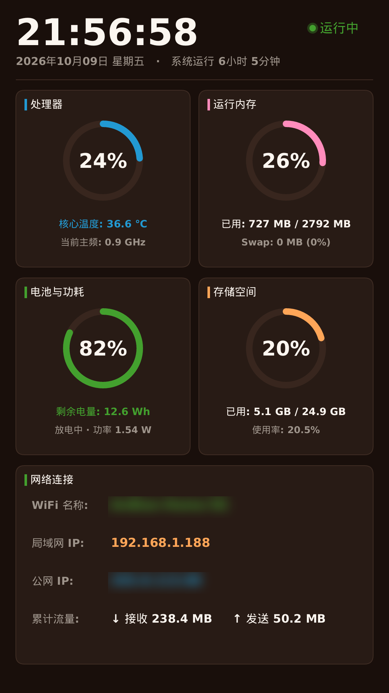

# Anbian

<p align="center">
  <b>专为废旧手机与嵌入式 Linux 设备打造的极致轻量、直接物理 Framebuffer 渲染的硬件仪表盘与边缘交互终端</b>
</p>

<p align="center">
  
  
  
  
  
</p>

---

## 📸 实机效果演示

> 运行于真实 ARM64 架构 Linux 设备（如旧智能手机 / 开发板）物理 Framebuffer 渲染捕获：

<p align="center">
  
</p>

---

## 💡 项目背景与设计哲学

当淘汰的旧智能手机被刷入纯净 Linux（如 Debian 13 / PostmarketOS / Ubuntu）改造成家庭服务器或旁路由时，传统的桌面环境（X11 / Wayland / DRM）或 Android 自身的 Java 运行时与 SurfaceFlinger 会霸占高达数百兆内存与宝贵的 CPU 算力。

**Anbian** 采用纯 Rust 构建，直接与 Linux 内核物理帧缓冲（`/dev/graphics/fb0` 或 `/dev/fb0`）与输入子系统（`/dev/input/event*`）对话：
- **零显示服务依赖**：无需 X11、Wayland、SurfaceFlinger 或任何第三方 GUI 运行时；
- **极致资源克制**：独立静态二进制仅 **~800 KB**，常驻内存仅约 **2 MB**，休眠时 CPU 占用严格保持 **0.00%**；
- **原生防撕裂光栅化**：基于 `tiny-skia` 软件抗锯齿光栅化引擎与硬件步幅（Stride）自动对齐，采用三缓冲双步提交，杜绝频闪与画面撕裂；
- **解耦平滑采样**：采用独立的度量工作线程固定窗口采集 CPU 利用率，彻底根除触控唤醒时事件循环微秒级提前返回导致的“瞬间 CPU 假高”问题。

---

## ✨ 核心特性

- 🖥️ **双列圆环卡片仪表盘**
  - **状态看板**：醒目数字大时钟、公历日期、星期、系统连续运行时间、翠绿呼吸状态指示；
  - **处理器 (CPU)**：实时平滑多核总利用率圆环、当前动态主频（GHz）、SoC 核心物理温度（°C）；
  - **运行内存 (RAM)**：已用/总物理内存大字号直观呈现、Swap 交换分区使用状态；
  - **电池与功耗**：剩余电量真实瓦时（Wh）计量、充放电状态及毫瓦级实时功率（W）；
  - **存储空间**：根文件系统已用/总量与占用百分比圆环；
  - **网络连接**：当前连接 WiFi 名称 (SSID)、局域网 IPv4 地址、公网 IP 地址、网卡累计收发吞吐流量。

- ⚡ **智能触控电源调度**
  - **常亮模式**：默认双击唤醒后持续点亮显示，每秒精准刷新一次系统指标；
  - **深度休眠**：双击屏幕瞬间关闭 LCD 硬件背光，底层事件调度进入 `poll(-1)` 阻塞态，0% CPU 消耗；
  - **失联防卫**：内置 SSHD 守护自愈，息屏或异常退出时确保远程 SSH 始终在线。

- ⏰ **自愈时区与校时引擎**
  - 旧手机断电关机后内置硬件 RTC 往往掉电重置为 1970 年；
  - AnBian 自动锁定 `Asia/Shanghai` (CST) 时区，并在检测到网络通畅时自动通过 NTP / HTTP 执行高精度时间校准。

---

## 🗺️ 路线图 (Roadmap)

Anbian 后续演进规划：

- [x] **v0.1.0 (当前版本)**：纯 Rust Framebuffer 核心引擎、双列方块圆环卡片、双击常亮/深度休眠、毫瓦级功耗计量、网络与系统指标
- [ ] **设置菜单系统 (Settings Menu)**：
  - 侧滑/长按调出轻量级触控设置抽屉；
  - 屏幕背光亮度精细调节（支持多级或滑动）；
  - 仪表盘刷新频率调节（1s / 2s / 5s / 动态节流）；
  - WiFi 快速扫描、切换与密码连接界面；
  - 主题配色切换（深色极客、奶油画报、高对比度等）。
- [ ] **内置终端界面 (Terminal UI / Embedded Console)**：
  - 基于 Framebuffer 的轻量级虚拟终端渲染器；
  - 支持从仪表盘平滑切换至命令行终端；
  - 屏幕软键盘或 USB/蓝牙外接键盘输入支持；
  - 系统日志实时滚动查看器（`journalctl` / `dmesg` 监控）。
- [ ] **通用设备配置适配层 (Device Profiles)**：
  - 支持 TOML 配置文件定义任意机型的分辨率、步幅 (Stride)、屏幕旋转角度 (0°/90°/180°/270°)；
  - 可配置的背光控制节点路径与触控输入节点路径。
- [ ] **插件化小组件 (Widgets)**：
  - 实时天气与空气质量卡片；
  - 局域网 Docker 容器状态与健康检查；
  - Home Assistant 物联网设备控制卡片。

---

## 🛠️ 编译与交叉构建

推荐在 Linux / WSL 2 环境下使用 Rust 工具链进行 `aarch64` 交叉编译：

```bash
# 1. 安装 aarch64 交叉编译工具链
sudo apt install -y gcc-aarch64-linux-gnu
rustup target add aarch64-unknown-linux-gnu

# 2. 克隆仓库
git clone https://github.com/TakotsuboChen/anbian.git
cd anbian

# 3. 极速 release 编译 (开启 LTO 与单二进制瘦身)
cargo build --release --target aarch64-unknown-linux-gnu

# 产物位于 target/aarch64-unknown-linux-gnu/release/anbian，大小约为 800 KB
```

---

## 🚀 部署与开机自启动

将编译好的二进制传输至目标设备：

```bash
# 上传至目标设备
scp target/aarch64-unknown-linux-gnu/release/anbian user@device-ip:/tmp/
ssh user@device-ip "sudo mv /tmp/anbian /usr/local/bin/dashboard-service && sudo chmod +x /usr/local/bin/dashboard-service"
```

配置开机剥离 Android 并拉起 AnBian 守护进程（以 Magisk / KernelSU 的 `service.d` 为例）：

```bash
# 剥离 Android 虚拟机与 SurfaceFlinger，释放 2.5GB 内存
stop

# 启动 AnBian Framebuffer 仪表盘
/usr/local/bin/dashboard-service > /var/log/dashboard-service.log 2>&1 &
```

---

## 📄 开源许可证

本项目基于 [MIT 许可证](LICENSE) 开源。
